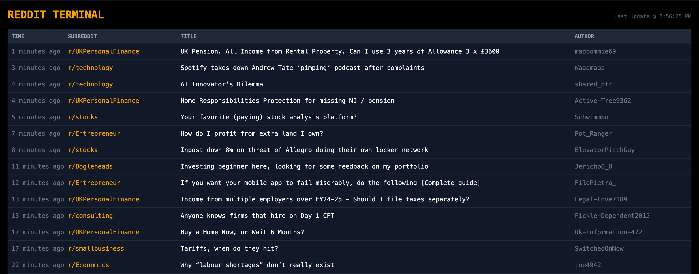
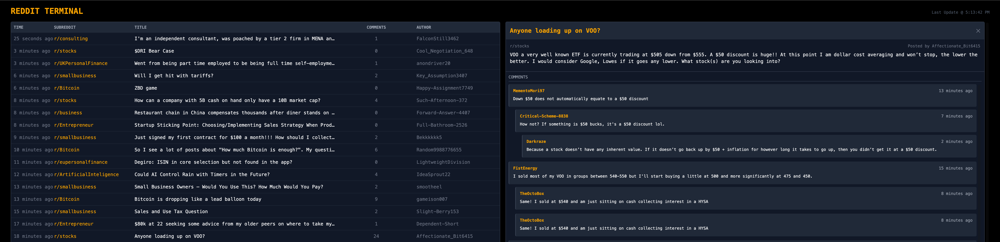

# Reddit Terminal

## Posts listed in frequency order



## Comments open on the right



### Tied of Ads or posts that Reddit thinks you may like? Me too.

This is a Reddit Aggregator that allows you to hardcode a list of subreddits that you're interested in. These can be added in the array within `api/index.js` called `SUBREDDITS` simply grab the subreddit name from the url and added it in there

Example url: `https://www.reddit.com/r/Bitcoin`.

Currently the hard coded subreddits are as follows:

```javascript
const SUBREDDITS = [
  'ArtificialInteligence',
  'Bitcoin',
  'BitcoinUK',
  'Bogleheads',
  'business',
  'consulting',
  'Economics',
  'Entrepreneur',
  'eupersonalfinance',
  'FIREUK',
  'financialindependence',
  'frugaluk',
  'Leadership',
  'passiveincome',
  'smallbusiness',
  'stocks',
  'technology',
  'UKInvesting',
  'UKPersonalFinance',
]
```

Once up and running the API will autopopulate the front end every 5 minuetes. The API caches the results in express so we can load results quicker.

## Get up and running.

To get up and running you will need build two images:

- `Dockerfile` - Dockerfile for the NextJS side of the application
- `api/Dockerfile` - Dockerfile to populate the API

Once uploaded to a registry you can then deploy via Docker Compose like so:

```Dockerfile
version: '3.8'

services:
  reddit-api:
    image: 192.168.7.1:5000/reddit_aggr_be:0.0.1
    ports:
      - '3001:3001'
    environment:
      - PORT=3001
    restart: unless-stopped
    healthcheck:
      test: ['CMD', 'curl', '-f', 'http://localhost:3001/subreddits']
      interval: 30s
      timeout: 10s
      retries: 3

  frontend:
    image: 192.168.7.1:5000/reddit_agggr_fe:0.0.1
    ports:
      - '3000:3000'
    environment:
      - NEXT_PUBLIC_API_URL=http://reddit-api:3001
    depends_on:
      - reddit-api
    restart: unless-stopped
```

This is an example of use with a self hosted registry
